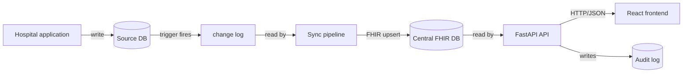
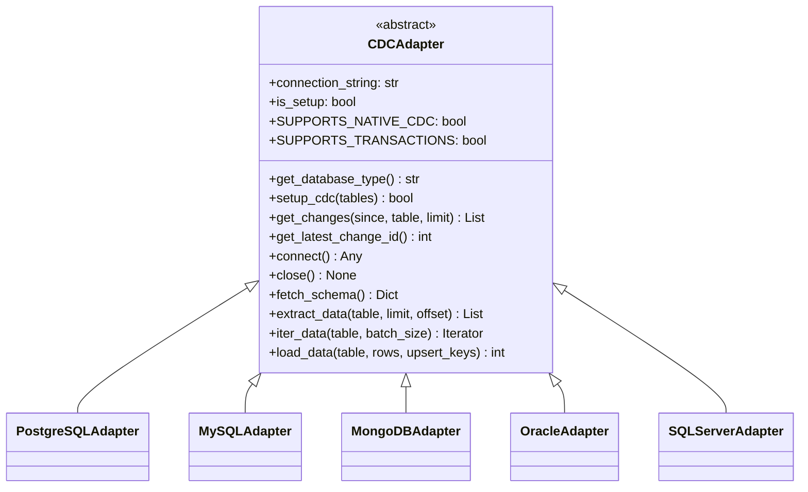
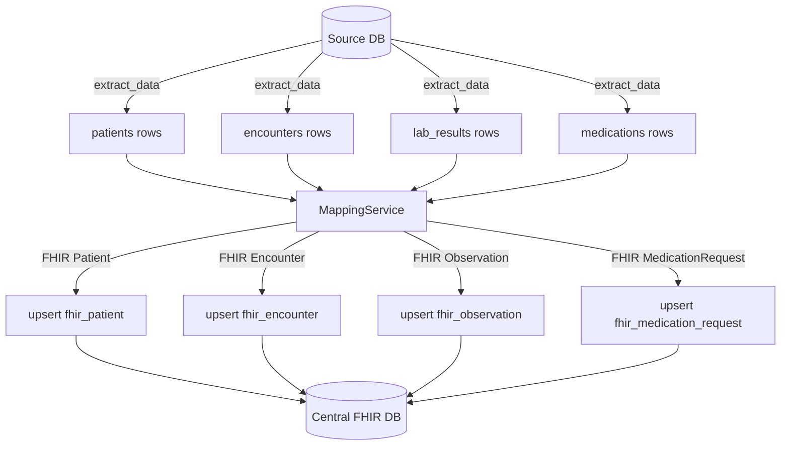
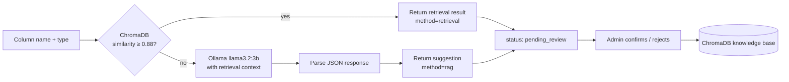
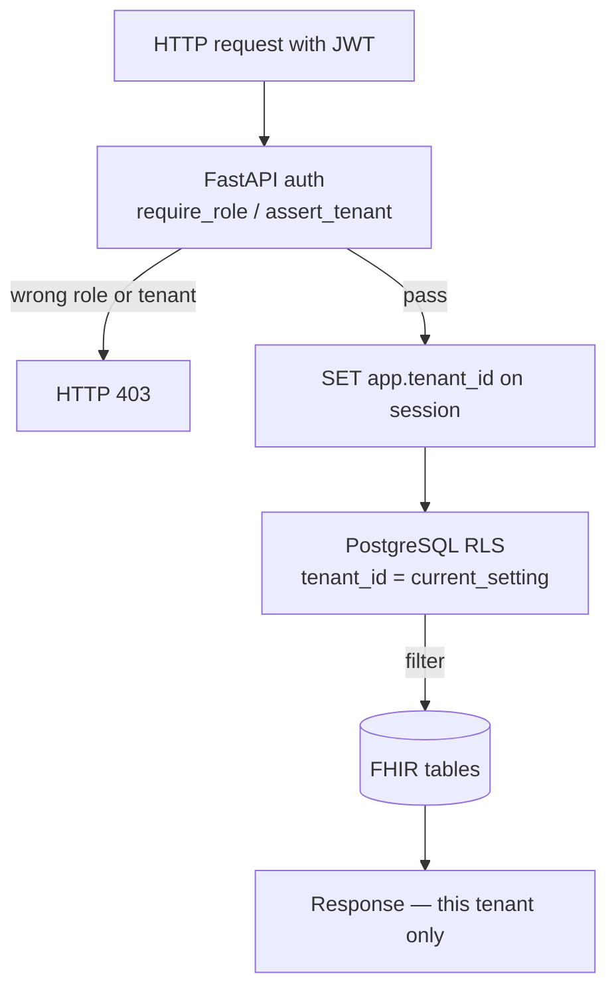
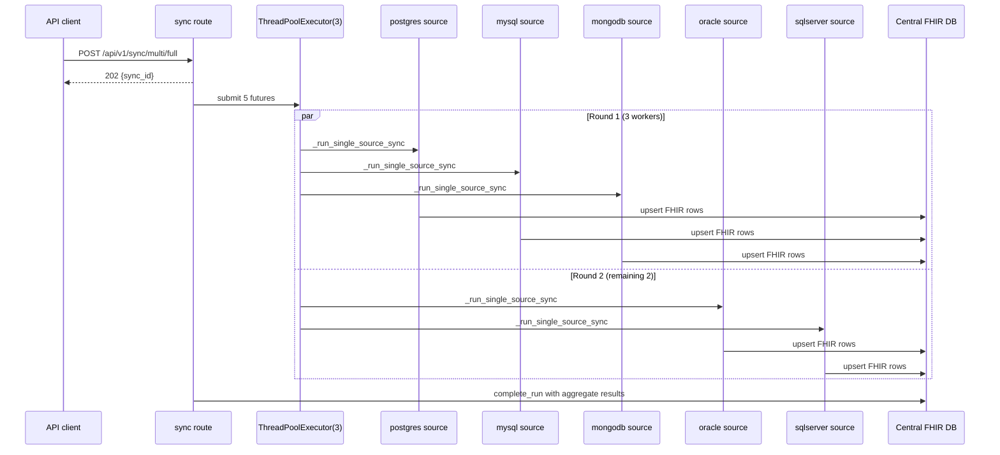
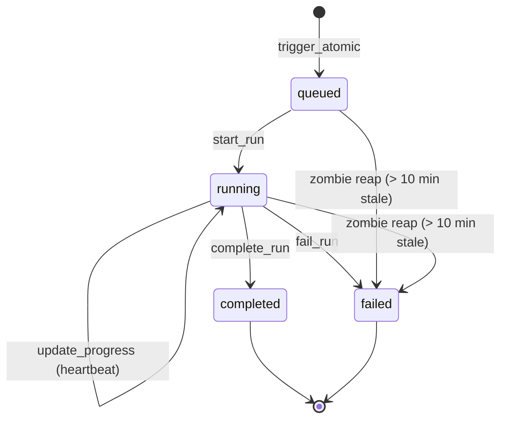
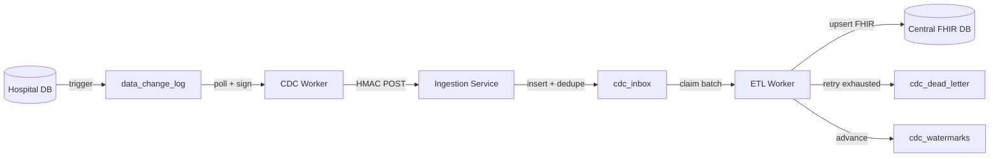

# CareLock-Sync
## Hospital Database Synchronisation with Multi-Platform CDC and Automated FHIR Mapping

---

**Final Year Project Report**
Submitted to the Department of Computer Science
in partial fulfilment of the requirements for the degree of
**Bachelor of Science in Computer Science**

**Bahria University Lahore Campus**

---

| | |
|---|---|
| **Student 1** | Waleed Khalid — 03-134222-111 |
| **Student 2** | Muhammad Mohsin — 03-134222-070 |
| **Student 3** | Shahmeer Nadeem — 03-134222-097 |
| **Supervisor** | Dr. Muhammad Saqib Sohail |
| **Session** | 2022–2026 |
| **Submission Date** | May 2026 |

---

## Declaration

We declare that this report describes our own work, carried out under the supervision of Dr. Muhammad Saqib Sohail. No part of it has been submitted for any other degree at this or any other institution. All sources are acknowledged in the references section.

Waleed Khalid &nbsp;&nbsp;&nbsp;&nbsp;&nbsp;&nbsp; \_\_\_\_\_\_\_\_\_\_\_\_\_\_\_\_\_\_\_

Muhammad Mohsin &nbsp;&nbsp; \_\_\_\_\_\_\_\_\_\_\_\_\_\_\_\_\_\_\_

Shahmeer Nadeem &nbsp;&nbsp;&nbsp; \_\_\_\_\_\_\_\_\_\_\_\_\_\_\_\_\_\_\_

---

## Acknowledgements

We thank Dr. Muhammad Saqib Sohail for pushing us to think harder about the design decisions we were glossing over, especially the tenant isolation model. The Department of Computer Science at Bahria University Lahore Campus gave us access to the lab machines we needed to run the Docker stack. We also want to acknowledge the open-source projects at the centre of this work — PostgreSQL, FastAPI, ChromaDB, and Ollama — because none of what we built would have been feasible without them.

---

## Abstract

CareLock-Sync is a data synchronisation system that reads patient records from hospital databases, converts them into FHIR R4 resources, and stores them in a central database with row-level tenant isolation. The system supports five source database platforms — PostgreSQL, MySQL, MongoDB, Oracle and SQL Server — each through a dedicated adapter that implements a common contract covering connection management, schema discovery, data extraction, data loading, and trigger-based change capture.

The central database stores FHIR Patient, Encounter, Observation and MedicationRequest resources in PostgreSQL with row-level security policies that enforce tenant boundaries at the database layer, independent of application code. Sensitive patient fields are encrypted at rest using AES-256-GCM with per-tenant keys derived through HKDF. Every access event is written to a tamper-resistant SQLite audit log.

Mapping an unfamiliar hospital schema to FHIR fields is handled by a retrieval-augmented engine backed by ChromaDB and a local Ollama language model. The engine runs similarity search first; when the top match is confident enough it returns the mapping directly without invoking the language model. Every suggested mapping sits in a pending state until an administrator confirms it.

The REST API exposes three multi-database sync endpoints — full, incremental, and single-source — that run source pipelines in parallel using a thread pool, isolate failures per source, and report structured results covering which sources succeeded and which did not. A React 19 frontend provides four role-based dashboards for administrators, hospital staff, doctors and analysts.

---

## Table of Contents

1. Introduction
   - 1.1 Background
   - 1.2 Problem Statement
   - 1.3 Project Objectives
   - 1.4 Scope
   - 1.5 Report Organisation

2. Literature Review and Software Requirements
   - 2.1 Healthcare Data Interoperability
   - 2.2 The FHIR R4 Standard
   - 2.3 Change Data Capture Approaches
   - 2.4 Retrieval-Augmented Generation for Schema Mapping
   - 2.5 Software Requirements Specification

3. Design and Methodology
   - 3.1 Architectural Overview
   - 3.2 Adapter Pattern and Multi-Platform CDC
   - 3.3 Source Database Design
   - 3.4 Central FHIR Database Design
   - 3.5 ETL Pipeline Design
   - 3.6 Mapping Suggestion Engine
   - 3.7 Authentication and Tenant Isolation
   - 3.8 Frontend Architecture
   - 3.9 Development Approach

4. Sustainable Development Goals Alignment
   - 4.1 Overview
   - 4.2 Selected Goals and Justification
   - 4.3 Targets Addressed
   - 4.4 Impact Assessment
   - 4.5 Stakeholders
   - 4.6 Ethical Considerations
   - 4.7 SDG Mapping Table
   - 4.8 Future Scope
   - 4.9 Summary

5. Implementation
   - 5.1 Project Structure
   - 5.2 Configuration and Environment
   - 5.3 Adapter Implementations
   - 5.4 ETL Pipeline Implementations
   - 5.5 REST API
   - 5.6 Multi-Database Sync Endpoints
   - 5.7 Database Schemas
   - 5.8 RAG Mapping Engine
   - 5.9 Security and Encryption
   - 5.10 Workflow Execution

6. Results and User Manual
   - 6.1 System Behaviour End to End
   - 6.2 Performance Measurement
   - 6.3 User Manual
   - 6.4 Discussion

7. Conclusion and Recommendations
   - 7.1 Conclusion
   - 7.2 Recommendations and Future Work

References

Appendix A — REST API Endpoint Reference
Appendix B — Field Mapping Examples
Appendix C — CDC Trigger Function (PostgreSQL)
Appendix D — Stress and Verification Test Plan

---

## List of Figures

Figure 3.1 — System architecture
Figure 3.2 — Adapter class hierarchy
Figure 3.3 — CDC flow on a hospital source database
Figure 3.4 — ETL pipeline: extract, transform, load
Figure 3.5 — Mapping suggestion workflow
Figure 3.6 — Three-layer tenant isolation
Figure 5.1 — Sync run state machine
Figure 5.2 — Multi-database parallel sync execution
Figure 5.3 — Service-based out-of-process pipeline

## List of Tables

Table 2.1 — Functional requirements
Table 2.2 — Non-functional requirements
Table 3.1 — Technology stack
Table 3.2 — Adapter capabilities by database
Table 4.1 — SDG mapping
Table 4.2 — Stakeholders
Table 5.1 — REST endpoint reference (selected)
Table 5.2 — Source-to-FHIR resource mapping

---

# Chapter 1 — Introduction

## 1.1 Background

Most hospitals that run digital records today are using software they built or bought at different points in time, often from different vendors, and the databases underneath that software do not agree on much. One system calls a patient's record number `medical_record_number`. Another calls it `mrn`. A third uses `pid`. The columns carry the same data but they are named differently, typed differently, and split across tables differently. When a patient moves between hospitals — or when a researcher tries to count how many patients in a city were admitted with a particular diagnosis last month — the mismatch makes that impossible without someone manually reconciling the data first.

The international response to this has been the development of FHIR (Fast Healthcare Interoperability Resources), a standard published by HL7 International that defines exactly what a patient record should look like, what an encounter looks like, what a lab result looks like, and how these resources relate to each other [1]. If hospitals exposed their data in FHIR, the cross-institution problem would largely go away. The reason this has not happened is that asking a hospital to change its database is not realistic. The system is running 24 hours a day, the staff are trained on what is already there, and any change has to be signed off by people who want to see patient outcomes improve, not internal database schemas.

CareLock-Sync is built on a simpler premise: leave the hospital database alone. The system connects to whatever the hospital is already using, reads from it, transforms what it finds into FHIR, and writes the result into a separate central database. The hospital software keeps running as it always has. The transformation logic lives entirely outside it.

## 1.2 Problem Statement

Hospital databases hold the same patient information in incompatible structures. Aggregating them into a usable, queryable dataset without changing the source systems requires solving three specific technical problems:

First, how to detect changes in a hospital database without modifying the application that writes to it. Polling on a timer is slow and wasteful. Log-based replication requires privileged server access. Trigger-based capture requires nothing beyond the ability to define a trigger, which is available to any database user with appropriate table privileges.

Second, how to translate a schema the system has never seen before into FHIR field paths, without requiring a developer to write mapping code by hand every time a new hospital connects. This needs some form of automated suggestion that a human can review before it takes effect.

Third, how to store data from multiple hospitals in one central database without one hospital being able to see another's records. This requires isolation that cannot be bypassed by a bug in application code.

## 1.3 Project Objectives

The project set out to build a working prototype that:

1. Reads from five database platforms — PostgreSQL, MySQL, MongoDB, Oracle and SQL Server — through a common adapter interface, without platform-specific logic scattered across the rest of the codebase.
2. Detects row-level changes through database triggers, with a persistent watermark that lets the system resume after a crash without re-processing or skipping records.
3. Converts source rows into FHIR R4 Patient, Encounter, Observation and MedicationRequest resources using a configurable field mapping.
4. Persists FHIR resources in a central PostgreSQL database with row-level security enforced at the database layer.
5. Suggests FHIR mappings for unknown schema columns through vector similarity search, falling back to a local language model for low-confidence cases, with administrator confirmation required before any suggestion is saved.
6. Exposes multi-database sync operations — full sync across all sources, bounded sync across all sources, and targeted single-source sync — through a REST API that runs sources in parallel and reports per-source results.
7. Provides a React frontend with role-specific dashboards for administrators, hospital staff, doctors and analysts.

## 1.4 Scope

The transformation layer covers four FHIR resources: Patient, Encounter, Observation and MedicationRequest. These four map directly to the four source tables (patients, encounters, lab_results, medications) used across all five supported platforms. The central store is PostgreSQL regardless of what the source database is.

Out of scope are clinical decision support, billing, insurance integration, FHIR write-back from the central store to any source system, and patient-facing access portals. The system reads from hospitals; it does not write back.

## 1.5 Report Organisation

Chapter 2 covers the background reading and software requirements. Chapter 3 describes the design decisions. Chapter 4 covers Sustainable Development Goals. Chapter 5 documents the implementation with references to specific files and functions. Chapter 6 contains the user manual, what performance testing was done, and a discussion of what worked and what did not. Chapter 7 concludes and lists what we would do differently or next.

---

# Chapter 2 — Literature Review and Software Requirements

## 2.1 Healthcare Data Interoperability

Hospitals have been storing data digitally long enough that most of them are now stuck with legacy schemas they cannot easily change. The data exists but it is not usable across institutions in its current form. The World Health Organisation's digital health strategy explicitly identifies interoperability as a precondition for the goals it sets for health systems globally [7]. The core technical problem is not complicated to state: different databases use different field names and structures for the same underlying clinical facts. The hard part is doing something about it without disrupting the hospital systems that are already running.

Attempts to solve this have generally gone in two directions. The first is standardisation — agreeing on a common data model and requiring everyone to use it. FHIR is the current consensus outcome of that direction. The second is integration middleware — systems that sit between existing databases and translate between their formats. CareLock-Sync falls in the second category. It does not ask hospitals to adopt FHIR internally; it does the translation for them, outside their existing software.

## 2.2 The FHIR R4 Standard

FHIR R4, published by HL7 International in 2019, defines roughly 150 resource types covering the clinical, administrative and financial aspects of a health record [1]. Each resource is a structured JSON document with defined fields, data types, and relationships to other resources. A Patient has an identifier, a name, a birth date, a gender and contact details. An Encounter references a Patient and carries a class, a status and a period. An Observation references both a Patient and an Encounter and carries a code and a value. A MedicationRequest references a Patient and carries the medication details and dosage.

The project uses four of these resources: Patient, Encounter, Observation and MedicationRequest. These four are enough to represent the clinical content in the source tables the system targets. Lab results map to Observation because that is the intended resource in FHIR for coded laboratory data — using LOINC codes for the test name and a quantity value for the result.

Mandel et al. [4] described how the FHIR ecosystem enables application portability through standardised REST APIs. CareLock-Sync does not implement the FHIR REST server specification, but the central database is shaped to FHIR R4, meaning a future FHIR server layer could read from it directly.

## 2.3 Change Data Capture Approaches

Change Data Capture is the general problem of detecting and acting on database changes as they happen rather than re-reading entire tables on a schedule [5]. Three main approaches exist.

Timestamp-based polling reads source tables periodically and compares timestamps against the last-run time. It is simple but misses deletes, is slow for large tables, and creates a window between polls where changes can accumulate.

Log-based CDC reads the database's write-ahead log or binary log directly and is the approach used by tools like Debezium. It is fast and low-impact but requires either a replication slot (PostgreSQL), binary logging enabled (MySQL), or similar server-level configuration — plus the permissions to access it. In a hospital environment where the project team does not control the database server, this is often not available.

Trigger-based CDC installs database functions that fire on INSERT, UPDATE and DELETE and write change records into a side table. It works on any database that supports triggers, requires no special server configuration, and is the approach used in CareLock-Sync across all five supported platforms.

The trade-off with triggers is that they run inside the transaction that caused the change, adding a small per-row cost. For a hospital workload — dominated by individual patient registrations, appointment bookings and test result entries rather than bulk import jobs — this overhead is manageable. The performance test in `tests/unit/test_cdc_performance.py` asserts that the trigger overhead stays below 5 milliseconds per row on a 1,000-row burst.

## 2.4 Retrieval-Augmented Generation for Schema Mapping

Mapping an unfamiliar column name to a FHIR path is a task where a language model can be useful but unreliable on its own. The model has seen FHIR documentation in training, but it has not seen this hospital's specific column names, and it can produce wrong answers with high confidence. Lewis et al. [3] introduced Retrieval-Augmented Generation as a way to reduce this kind of error: retrieve relevant examples from a knowledge base first, then give that context to the model before it generates.

CareLock-Sync uses a retrieval-first variant. The vector store holds 38 curated FHIR field mappings, each expanded with alias variants, stored in ChromaDB with cosine distance. When a column is submitted for mapping, the system queries the vector store. If the top result has cosine similarity at or above 0.88, the mapping is returned directly and the language model is not called. Only when retrieval confidence falls below that threshold does the system invoke the local Ollama model, passing the retrieval results as context in the prompt.

This design choice came from a practical observation: most hospital column names are variations of the same small vocabulary. Column names like `pat_num`, `pid`, `patient_id`, and `medical_record_number` all mean the same thing, and the vector store's alias expansion catches most of these without needing a language model. The LLM handles the cases where the alias expansion fails — genuinely unusual naming conventions that fall outside the curated set.

## 2.5 Software Requirements Specification

### 2.5.1 Functional Requirements

The functional requirements listed in Table 2.1 were derived from the project objectives and refined as implementation progressed.

The following table describes the functional requirements for CareLock-Sync. Each requirement is identified by an ID and a brief statement of what the system must do.

**Table 2.1 — Functional requirements**

| ID | Requirement |
|----|-------------|
| FR-1 | The system shall capture INSERT, UPDATE and DELETE operations on configured tables of a PostgreSQL, MySQL, MongoDB, Oracle or SQL Server source database through database triggers or equivalent change-log mechanisms. |
| FR-2 | The system shall persist captured changes in a queryable change log with a monotonically increasing identifier per source database. |
| FR-3 | The system shall transform captured rows into FHIR R4 Patient, Encounter, Observation and MedicationRequest resources using a declarative field mapping configuration. |
| FR-4 | The system shall write FHIR resources to a central PostgreSQL database using upsert semantics keyed on the source record identifier and tenant. |
| FR-5 | The system shall support full and incremental sync modes for the PostgreSQL source, automatically selecting incremental after the first successful full run. |
| FR-6 | The system shall maintain a per-source watermark so that an interrupted incremental run resumes from the last successfully processed change. |
| FR-7 | The system shall suggest a FHIR field mapping for an unknown column using vector similarity search, falling back to a local language model when retrieval confidence is below 0.88. |
| FR-8 | The system shall require administrator confirmation before any suggested mapping is written to the knowledge base. |
| FR-9 | The system shall authenticate users with JWT bearer tokens and enforce role-based access for admin, hospital, doctor and analyst roles. |
| FR-10 | The system shall isolate tenant data at the application layer, at the database session layer, and at the row-level security layer. |
| FR-11 | The system shall expose multi-database sync endpoints — full across all sources, bounded across all sources, and single source — that run sources in parallel and return per-source results. |
| FR-12 | The system shall log authentication, sync and system events to a persistent audit store. |

### 2.5.2 Non-Functional Requirements

**Table 2.2 — Non-functional requirements**

| ID | Requirement |
|----|-------------|
| NFR-1 | A crash during incremental sync must not skip records. The watermark advances only after a batch completes successfully. |
| NFR-2 | Patient identifiers (SSN, phone, email, MRN) must be encrypted at rest using AES-256-GCM with per-tenant keys derived through HKDF from a global master key. |
| NFR-3 | Login attempts must be rate-limited per email address. |
| NFR-4 | Cross-tenant data access must be blocked by row-level security at the database layer, independent of application code. |
| NFR-5 | The mapping engine must function without an external paid API — the default configuration uses a locally hosted Ollama model. |
| NFR-6 | Multi-database sync must isolate failures: one source failing must not abort the others. |
| NFR-7 | The system must be deployable through Docker Compose for development and demonstration. |

### 2.5.3 Constraints

The source and central databases run as PostgreSQL containers on host ports 5435 and 5433 respectively in the Docker Compose setup. MySQL, MongoDB, Oracle XE and SQL Server run as additional Docker containers, each with their own port. The Ollama service must be reachable on `localhost:11434` with the required models pulled. The frontend expects the API at the URL set in `VITE_API_URL`.

---

# Chapter 3 — Design and Methodology

## 3.1 Architectural Overview

The system has three physical tiers: the hospital sources, the central database, and the application layer between them. Hospital databases stay as they are — the project adds triggers and a change log table to each one, but the hospital application above them is not touched. The central PostgreSQL database is under the project's control and holds the FHIR tables, tenant management, sync state, and the CDC infrastructure for the modular worker pipeline. The application layer is a FastAPI backend, a set of optional out-of-process worker services, and a React frontend.

Figure 3.1 shows how data flows through the system. A write to a hospital database fires a trigger, which appends a record to the local change log. Either an in-process background task or the out-of-process CDC worker picks that change up, the ETL pipeline transforms it into a FHIR resource, and the resource is upserted into the central database. The API server reads from the central database and serves the frontend.



Figure 3.1 — System architecture showing data flowing left to right from hospital source to frontend.

The system has two deployment configurations that share the same underlying pipeline classes. The in-process configuration runs the ETL pipeline inside FastAPI background tasks — useful for development, demos and single-source setups where simplicity matters more than independent scaling. The service-based configuration runs the CDC worker, ingestion service and ETL worker as separate processes communicating through queue tables in the central database — the right shape when sources need to be scaled or restarted independently.

## 3.2 Adapter Pattern and Multi-Platform CDC

The clearest design decision in the codebase is the abstract adapter. `CDCAdapter` in `backend/cdc/base_adapter.py` defines two groups of methods. The CDC contract — `setup_cdc`, `get_changes`, `get_latest_change_id`, `is_cdc_enabled` — was the original interface. The operational ETL surface — `connect`, `close`, `fetch_schema`, `extract_data`, `iter_data`, `load_data` — was added later to make every adapter usable as both a CDC source and a direct ETL source.

The factory in `backend/cdc/adapter_factory.py` resolves a connection string to the right adapter class by scheme. It handles thirteen scheme variants covering the five platforms: `postgresql`, `postgres`, `postgresql+psycopg2` for PostgreSQL; `mysql`, `mysql+pymysql` for MySQL; `mongodb`, `mongodb+srv` for MongoDB; `oracle`, `oracle+oracledb`, `oracle+cx_oracle` for Oracle; `sqlserver`, `mssql`, `mssql+pyodbc` for SQL Server. Drivers are imported lazily so that a missing optional driver (such as `pyodbc` on a machine without the ODBC driver installed) raises a clear `ImportError` with installation instructions rather than breaking unrelated adapters.

The class hierarchy and capability flags are shown in Figure 3.2.



Figure 3.2 — Adapter class hierarchy. Every concrete adapter implements all methods; the five platforms differ only in the SQL dialect and CDC mechanism they use.

Table 3.2 summarises what each adapter supports.

**Table 3.2 — Adapter capabilities by database**

| Database | CDC mechanism | Upsert syntax | Transaction support | Notes |
|---|---|---|---|---|
| PostgreSQL | Trigger + `data_change_log` + `pg_notify` | `ON CONFLICT ... DO UPDATE` | Yes | Streaming via server-side cursor; `pg_notify` for push notification |
| MySQL | Trigger + `data_change_log` (JSON columns, InnoDB) | `ON DUPLICATE KEY UPDATE` | Yes | Works on stock `mysql:8.0` without binlog configuration |
| MongoDB | Change-log collection + `$inc` counter | `bulk_write([UpdateOne(...upsert=True)])` | No (standalone) | Native change streams supported when replica set available |
| Oracle | Trigger + `DATA_CHANGE_LOG` + sequence | `MERGE ... USING DUAL` | Yes | Prefers `oracledb` thin mode; falls back to `cx_Oracle` |
| SQL Server | Trigger + `data_change_log` (`FOR JSON PATH`) | `MERGE ... WHEN MATCHED / NOT MATCHED` | Yes | Requires ODBC Driver 17 or 18; avoids `sys.sp_cdc_*` SQL Agent dependency |

## 3.3 Source Database Design

The source schema used across all five platforms is defined in `backend/scripts/seed_all_dbs.py` and in `databases/hospital-dbs/01_schema.sql` for the PostgreSQL variant. It contains four tables: `patients`, `encounters`, `lab_results` and `medications`.

The patient table holds one row per registered patient: a primary key, a medical record number, first and last name, date of birth, gender and contact details. The encounter table holds visits, referencing the patient. The lab results table holds test results, referencing both the encounter and the patient. The medications table holds prescriptions, also referencing both.

The SQLAlchemy ORM models in `backend/common/models.py` map to this schema for the PostgreSQL path. Columns, relationships and primary keys are declared; the ORM layer is used only for the legacy in-process PostgreSQL ETL pipeline. The multi-database pipeline reads from any adapter through `extract_data()` and never uses the ORM models.

## 3.4 Central FHIR Database Design

The central database schema is defined across several SQL files in `databases/shared-db/`. The core FHIR tables — `fhir_patient`, `fhir_encounter`, `fhir_observation` and `fhir_medication_request` — each carry a `tenant_id` column referencing `hospital_tenants`, and a unique constraint on `(tenant_id, source_*_id)` to enforce upsert idempotency.

The `fhir_patient` table uses PostgreSQL array types for `given_name` and `address_line` because FHIR allows multiple values in both fields. The `fhir_observation` table separates a numeric value (`value_quantity_value`, `value_quantity_unit`) from a text value (`value_string`) because lab results are sometimes numeric (a measured value with units) and sometimes qualitative (a text interpretation). The `fhir_medication_request` table splits `dosage_text` from `dosage_dose_value` and `dosage_dose_unit` for the same reason.

Row-level security policies defined in `p1_step4_rls.sql` enforce tenant isolation at the PostgreSQL layer. Each policy compares the row's `tenant_id` against `current_setting('app.tenant_id')`. Before any query against a FHIR table, the application sets this session-scoped parameter. The admin role bypasses RLS because administrators legitimately need cross-tenant visibility.

## 3.5 ETL Pipeline Design

The system has two ETL paths that share the same FHIR load layer.

The legacy path in `backend/etl/pipeline.py` extracts data through SQLAlchemy ORM queries against the PostgreSQL hospital database and is used by `POST /api/v1/sync/full` and `POST /api/v1/sync/incremental`. It processes entities in dependency order — patients first (because encounters reference them), then encounters, then observations, then medications — and uses upsert SQL against the central database.

The multi-database path in `backend/etl/multi_db_pipeline.py` extracts data through `adapter.extract_data()` and can work with any of the five source platforms. It delegates the load step to the same `ETLPipeline.load_*` methods used by the legacy path, so the SQL that writes FHIR resources into the central database is defined in one place. The transform step routes each row through `MappingService` using the same field mapping configuration that the legacy path uses.

Figure 3.3 shows how data moves through one full ETL cycle.



Figure 3.3 — ETL pipeline from source extraction through FHIR mapping to central load.

The incremental sync in `backend/etl/incremental_sync.py` reads from `data_change_log` rather than from the source tables directly. It processes each change by its operation type: for INSERT and UPDATE it re-fetches the current row from the source by primary key and runs the same transform-and-load steps; for DELETE it deletes the corresponding FHIR row from the central database, scoped to the tenant. Duplicates within a batch — when the same record appears multiple times in the change log window — are collapsed to the last operation only before per-record processing begins.

## 3.6 Mapping Suggestion Engine

The mapping engine answers the question: given a column name and type from a schema the system has not seen before, what FHIR field should it map to?

Figure 3.4 shows the flow. A column submission hits the vector store first. ChromaDB computes cosine similarity between the submitted column's embedding and the stored knowledge base entries. If the best match has similarity at or above 0.88, the engine returns that mapping with `method: retrieval` and never calls the language model. Otherwise, the top candidates from the vector store are passed as context to the mapping model (llama3.2:3b through Ollama), which generates a single-line JSON response that is parsed and returned with `method: rag`.



Figure 3.4 — Mapping suggestion workflow. Only confirmed mappings are written back to the knowledge base.

The knowledge base in `backend/rag/fhir_knowledge.py` contains 38 canonical FHIR field entries, each with a list of alias names that are expanded into separate vector store entries at startup. This alias expansion is what allows the retrieval step to match `pid`, `pat_num`, `patient_number` and `PTNT_ID` all to the same mapping for `Patient.identifier[0].value`.

The chat endpoint at `/api/v1/rag/chat` uses a different model — phi3 through Ollama — for free-form questions about FHIR mappings. The same retrieval step runs first to provide context. This model is heavier than the mapping model and has a 180-second timeout in the frontend client because cold-start inference on CPU can be slow.

## 3.7 Authentication and Tenant Isolation

Authentication uses HS256 JWT tokens issued by `POST /api/v1/auth/login`. The token payload carries the user's email, role, display name, tenant identifier and hospital name. The backend `AuthContext` model in `backend/common/auth.py` decodes and validates the token on every request through FastAPI dependency injection.

Tenant isolation runs at three layers, shown in Figure 3.6. At the application layer, the `require_role` and `assert_tenant` helpers block requests whose role or tenant does not match. At the connection layer, every endpoint that queries FHIR data executes `SET app.tenant_id = :tid` on the database session before running queries. At the database layer, PostgreSQL row-level security policies compare each row's `tenant_id` against `current_setting('app.tenant_id')` and reject non-matching rows.



Figure 3.6 — Three-layer tenant isolation. A failure at any one layer is caught by the layers below it.

Login attempts are rate-limited in `backend/common/auth.py` using a sliding-window counter per email address. Ten failures within sixty seconds returns HTTP 429. A multi-factor authentication module exists in `backend/security/mfa.py` using TOTP via `pyotp`; the module is implemented but not yet wired into the login route.

## 3.8 Frontend Architecture

The frontend is a React 19 single-page application built with Vite 7, styled with Tailwind 4, using React Router 7 for routing and TanStack Query for server state. The entry point is `frontend-app/src/App.tsx`, which defines four role-based route trees — `/admin/*`, `/hospital/*`, `/doctor/*`, `/analyst/*` — each loaded through `React.lazy()` so that navigating to the admin dashboard does not download the doctor or analyst code.

The shared API client in `frontend-app/src/shared/services/api.ts` is a single Axios instance with a request interceptor that attaches the JWT `Authorization: Bearer` header and a response interceptor that clears local storage and redirects to `/auth/login` on a 401. Sessions that expired (as opposed to never existing) are flagged through `sessionStorage` so the login page can show "Session expired" rather than a blank form.

## 3.9 Development Approach

Development followed an iterative sprint model. The CDC monitor is internally annotated as version 3 with nine numbered risk mitigations; the schema mapper references Sprint 1 fixes for tenant context; the RAG engine references Sprint 4 for the dual-model architecture; the multi-database adapters were added as Sprint 6. Database migrations are checked in as numbered SQL files in `databases/shared-db/` so the central schema can be rebuilt step by step. Verification scripts in `backend/scripts/` cover each major integration point and serve as the closest thing to integration tests in the project.

**Table 3.1 — Technology stack**

| Layer | Choice |
|---|---|
| Backend framework | FastAPI 0.104.1 |
| ORM | SQLAlchemy 2.0.23 |
| Backend language | Python 3.10 |
| Source databases | PostgreSQL 15, MySQL 8, MongoDB 7, Oracle XE 21, SQL Server 2022 |
| Central database | PostgreSQL 15 |
| Authentication | HS256 JWT (python-jose) + bcrypt (passlib) |
| Vector store | ChromaDB 0.4.22 |
| LLM runtime | Ollama (nomic-embed-text, llama3.2:3b, phi3) |
| Encryption | AES-256-GCM + HKDF (production_encryption.py) |
| Frontend framework | React 19 + Vite 7 |
| Frontend language | TypeScript 5.9 |
| HTTP client | Axios 1.13 |
| Server state | TanStack Query 5.90 |
| Routing | React Router 7 |
| Styling | Tailwind CSS 4 |
| Charts | Recharts 3.8 |
| Container runtime | Docker Compose |

---

# Chapter 4 — Sustainable Development Goals Alignment

## 4.1 Overview

The United Nations Sustainable Development Goals are 17 goals adopted in 2015 with a 2030 target date, covering health, infrastructure, education, inequality and several other areas [6]. CareLock-Sync is directly relevant to two of them.

## 4.2 Selected Goals and Justification

The primary goal addressed is **SDG 3 — Good Health and Well-being**. The project's purpose is to make patient data available in a standard format across institutions. This directly supports continuity of care: a patient who arrives at a new hospital with their complete history already accessible is receiving a meaningfully different level of service from one who has to reconstruct their history from memory. The system does not deliver clinical care, but it removes a data-layer friction that gets in the way of it.

The secondary goal is **SDG 9 — Industry, Innovation and Infrastructure**. The project builds integration infrastructure — specifically, the plumbing that lets hospital databases participate in a shared data ecosystem without being replaced. The adapter pattern and the standard interface make it easier to connect a new hospital than it would be to write a bespoke integration from scratch each time.

## 4.3 Targets Addressed

Within SDG 3, the project touches Target 3.8 (universal health coverage, including quality essential health services) through the continuity of records it enables, and Target 3.d (strengthening health information systems for early warning and risk reduction) through the standardised aggregated dataset it produces.

Within SDG 9, the project relates to Target 9.c (increasing access to information and communications technology and providing affordable access) in the sense that building open, standards-based health data infrastructure is the healthcare version of that goal.

## 4.4 Impact Assessment

The social impact is the most concrete. A doctor treating a patient who transferred from another hospital can see that patient's recent lab results and current medications rather than ordering duplicates. This matters most for patients with chronic conditions who move frequently between providers.

The economic impact is mostly cost avoidance — fewer repeated tests, less manual data reconciliation, less time spent re-entering data that already exists somewhere else. These savings are diffuse and show up across the health system rather than at any one institution, which is part of why the problem persists: the entity that funds the fix does not always capture the savings.

The technological contribution is a reusable pattern. The combination of trigger-based CDC, retrieval-first mapping, and row-level multi-tenant isolation applies to any domain where heterogeneous databases need to contribute to a shared standard, not just healthcare.

The project has no significant environmental footprint beyond a standard multi-container local deployment.

## 4.5 Stakeholders

The following table lists the stakeholders involved in or affected by CareLock-Sync.

**Table 4.2 — Stakeholders**

| Stakeholder | Relationship to the system |
|---|---|
| Patients | Primary beneficiaries; do not interact directly but benefit from record continuity. |
| Hospital administrators | Onboard their hospital, manage sync configuration, monitor sync health. |
| Doctors | Browse aggregated patient records through the doctor-role dashboard. |
| Data analysts | Run reporting and data quality checks through the analyst-role dashboard. |
| System administrators | Manage tenants, run migrations, monitor the full system through the admin dashboard. |
| Health regulators | Indirect — the central FHIR database produces the kind of standardised dataset that national health registries require. |

## 4.6 Ethical Considerations

Patient health data carries legal protection in every jurisdiction. The system handles this in three ways. First, sensitive identifying fields (SSN, phone, email and medical record number) are encrypted at rest using AES-256-GCM with per-tenant key derivation through HKDF, so a database-level breach does not expose plaintext values. Second, the medical record number is also indexed through an HMAC-derived hash, allowing lookup by MRN without decrypting the stored value. Third, every PHI access goes through an audit logger in `backend/security/production_encryption.py` that writes to a tamper-resistant SQLite file.

The language model component uses only a locally hosted Ollama model rather than a hosted API. This is deliberate: sending hospital schema information — even just column names — to an external service is an unnecessary data outflow. The retrieval-first design means the model is called far less often than a naïve implementation would call it.

Patient consent at the individual record level is not modelled in this prototype. In a real deployment, the central database would need per-patient consent enforcement, not just per-tenant isolation. This is noted here rather than left implied.

## 4.7 SDG Mapping Table

**Table 4.1 — SDG Mapping**

| Project component | SDG | Target | Contribution |
|---|---|---|---|
| FHIR ETL pipeline | SDG 3 | 3.8 | Produces standard records enabling cross-hospital care continuity. |
| Multi-tenant central database | SDG 3 | 3.d | Aggregates standardised data usable for population-level analysis. |
| Multi-platform adapter layer | SDG 9 | 9.c | Demonstrates a non-invasive integration pattern for existing health information systems. |
| Retrieval-first mapping engine | SDG 9 | 9.c | Reduces the manual effort of connecting a new hospital, lowering the interoperability barrier. |
| RLS + PHI encryption | SDG 3 | 3.8 | Protects patient trust, without which interoperability cannot be deployed. |

## 4.8 Future Scope

Adding write-back — pushing FHIR resources from the central database back to a source format — would let clinicians at one hospital view data that originated at another through their existing hospital software rather than through the CareLock frontend. This is the most impactful extension from a patient care perspective.

Adding a FHIR REST server layer on top of the central database would make the data accessible to other FHIR-aware tools without requiring direct database access. The data is already FHIR-shaped; the REST layer would be thin.

## 4.9 Summary

CareLock-Sync contributes to SDG 3 through the patient care continuity that its FHIR aggregation supports, and to SDG 9 through the integration infrastructure it builds. Both contributions are at the prototype scale. We have not overstated the scope.

---

# Chapter 5 — Implementation

## 5.1 Project Structure

The repository is organised into a Python backend (`backend/`), a TypeScript frontend (`frontend-app/`), Docker Compose definitions (`docker-compose.yml`), and SQL migration files (`databases/`). Inside the backend, directories are separated by concern: `api/` for the FastAPI application and routes; `cdc/` for adapters; `common/` for shared modules; `etl/` for pipeline logic; `schema_mapper/` for field mapping configuration; `rag/` for the mapping engine; `security/` for encryption, MFA and rate limiting; `services/` for the out-of-process worker services; and `scripts/` for verification and seeding utilities.

The FastAPI application starts in `backend/api/main.py` on port 8003. Eight route modules are registered at startup through a `_load_router()` helper that fails loudly if any module cannot be imported. A startup hook then audits every registered route and asserts that a set of critical routes are present — a guard against configuration drift.

## 5.2 Configuration and Environment

Application configuration is handled by a Pydantic `Settings` class in `backend/common/config.py` that reads from environment variables, with a `.env` file under `config/` as the source during development. The required keys are the hospital and shared database URLs, the JWT secret key, the Ollama base URL and model names, and the ChromaDB storage path.

Multi-source configuration is in `config/sync_config.json`, which lists each source database with its connection string, the tables or collections to monitor, and an identifier string. This file is read by the multi-database sync endpoints at request time and cached in module memory. Five sources are declared: one for each supported platform.

## 5.3 Adapter Implementations

All five adapter classes are in `backend/cdc/`. Each one is a self-contained file implementing the full `CDCAdapter` contract.

**PostgreSQLAdapter** (`cdc/postgresql_adapter.py`, 203 lines): Uses SQLAlchemy with `psycopg2-binary`. The `setup_cdc` method delegates to `CDCMonitor.add_trigger_to_table()` in `connector/cdc_monitor.py`, which installs the `log_table_changes` trigger function. The `get_changes` method queries `data_change_log` by `change_id > since_id`. The `iter_changes_since` method in `CDCMonitor` streams results through a server-side psycopg2 cursor in fixed-size batches. CDC notification uses `pg_notify` on the `data_changes` channel. `SUPPORTS_NATIVE_CDC = True`.

**MySQLAdapter** (`cdc/mysql_adapter.py`, 348 lines): Uses SQLAlchemy with `PyMySQL`. The CDC log table is created with `ENGINE=InnoDB` and JSON columns for old and new data. Triggers are created per operation (INSERT, UPDATE, DELETE) because MySQL does not support `AFTER INSERT OR UPDATE OR DELETE` in a single trigger definition. The trigger body uses `JSON_OBJECT(...)` built dynamically from the column list discovered through `inspector.get_columns()`. Upsert uses `ON DUPLICATE KEY UPDATE`. `SUPPORTS_NATIVE_CDC = True` (flag notes binlog path exists but is not used here).

**MongoDBAdapter** (`cdc/mongodb_adapter.py`, 349 lines): Uses `pymongo`. Because the Docker deployment runs MongoDB as a standalone node without a replica set, native change streams — which require a replica set — are not available in the default configuration. The adapter uses a polled `data_change_log` collection with a `$inc`-based atomic counter in a `_cdc_meta` document for monotonic change IDs. The `load_data` method logs changes to the change collection as a side effect of writing. `fetch_schema` samples up to 25 documents per collection to infer a column list rather than relying on a fixed schema. ObjectId and datetime values are normalised to JSON-friendly strings in `_normalise()`. `SUPPORTS_TRANSACTIONS = False` on standalone.

**OracleAdapter** (`cdc/oracle_adapter.py`, 417 lines): Detects the available Oracle driver at import time — `oracledb` (thin mode, no Instant Client) is preferred, with `cx_Oracle` as fallback. The connection string normaliser translates `oracle://` to `oracle+oracledb://` and handles the PDB service-name format used by Oracle XE 21c (`XEPDB1`). The CDC log table is `DATA_CHANGE_LOG` (Oracle convention is uppercase unquoted identifiers) with a companion `DATA_CHANGE_LOG_SEQ` sequence providing the primary key. Triggers are installed as `TRG_{TABLE}_CDC` using `CREATE OR REPLACE TRIGGER`. Upsert uses Oracle's `MERGE ... USING DUAL` syntax. Row-key values are normalised to lowercase after extraction because Oracle returns column names in uppercase by default.

**SQLServerAdapter** (`cdc/sqlserver_adapter.py`, 396 lines): Uses SQLAlchemy with `pyodbc` and the Microsoft ODBC Driver 17 or 18. The driver is detected at import time via `pyodbc.drivers()`; a clear `ImportError` with a documentation link is raised if neither is found. The connection string parser handles passwords containing `@` characters, which `urlparse` mishandles, through a regex-based split. The CDC log table is created with an `IDENTITY(1,1)` primary key column. Triggers use `CREATE OR ALTER TRIGGER` (SQL Server 2016+) and `FOR JSON PATH, WITHOUT_ARRAY_WRAPPER` to serialise old and new row states. Upsert uses SQL Server's `MERGE` statement. Pagination uses `OFFSET ... ROWS FETCH NEXT` when offset > 0 and `SELECT TOP N` when offset is zero.

The factory class in `cdc/adapter_factory.py` resolves a connection string to the correct adapter through a `_SCHEME_REGISTRY` dict that maps scheme strings to lazy-loading callables. `CDCAdapterFactory.create_adapter(conn_str)` is the single public entry point for creating an adapter from anywhere in the codebase.

## 5.4 ETL Pipeline Implementations

**ETLPipeline** (`etl/pipeline.py`): PostgreSQL-specific full sync using SQLAlchemy ORM. Called by `POST /api/v1/sync/full` when mode resolves to `full`. Processes patients, encounters, observations and medications in that dependency order. Accepts a progress callback that the sync route uses to update the `sync_runs` row in real time. Reports per-entity counts (extracted, loaded, errors).

**IncrementalSync** (`etl/incremental_sync.py`): PostgreSQL-specific change-driven sync using `CDCMonitor`. Called by `POST /api/v1/sync/incremental`. Loads the per-tenant watermark, streams `data_change_log` in batches, deduplicates by `(table, record_id)` keeping the last operation, and advances the watermark only after each complete batch succeeds.

**MultiDBPipeline** (`etl/multi_db_pipeline.py`, 252 lines): Source-agnostic ETL using any `CDCAdapter` instance. Calls `adapter.extract_data()` for each of the four entity types in the resource plan, routes each row through `MappingService` (with a fallback through `FHIRMapper` directly when `MappingService` is unavailable), and delegates the load step to `ETLPipeline.load_patients`, `ETLPipeline._load_encounters`, `ETLPipeline._load_observations` and `ETLPipeline._load_medications`. This reuse means the SQL for writing FHIR resources exists in one place.

## 5.5 REST API

The API is registered in `backend/api/main.py` through `app.include_router()` calls for eight route modules. All routes are under `/api/v1/` except the health check at `/health` and auth routes at `/api/v1/auth/`. The OpenAPI documentation is available at `/docs`.

A representative subset of endpoints is shown in Table 5.1. The complete list is printed to the server log on startup by the route audit hook.

**Table 5.1 — REST endpoint reference (selected)**

| Method | Path | Auth | Purpose |
|---|---|---|---|
| POST | `/api/v1/auth/login` | None | Authenticate, return JWT |
| GET | `/api/v1/auth/me` | Any | Validate token, return profile |
| POST | `/api/v1/sync/full` | write | Queue full or auto-mode sync (PostgreSQL) |
| POST | `/api/v1/sync/incremental` | write | Queue incremental CDC sync (PostgreSQL) |
| GET | `/api/v1/sync/status` | any | Current or most recent run status |
| GET | `/api/v1/sync/history` | any | Recent run history |
| POST | `/api/v1/sync/multi/full` | admin | Full ETL across all configured sources |
| POST | `/api/v1/sync/multi/incremental` | admin | Bounded ETL across all configured sources |
| POST | `/api/v1/sync/multi/{source_id}` | admin | Full ETL for a single named source |
| GET | `/api/v1/connector/schema` | admin | Discover PostgreSQL hospital schema |
| GET | `/api/v1/connector/tenants` | any | List onboarded hospitals |
| GET | `/api/v1/connector/health` | any | All-DB connectivity check |
| GET | `/api/v1/stats` | any | Dashboard FHIR resource counts |
| GET | `/api/v1/encounters` | any | Tenant-scoped encounter list |
| POST | `/api/v1/rag/suggest/schema` | any | Mapping suggestions for a table |
| POST | `/api/v1/rag/mappings/confirm-batch` | admin | Confirm a batch of mapping suggestions |
| POST | `/api/v1/rag/chat` | any | Free-form FHIR mapping chat |
| GET | `/api/v1/rag/status` | any | Mapping engine readiness |

## 5.6 Multi-Database Sync Endpoints

The three new endpoints added to `backend/api/routes/sync.py` cover the case where the caller wants to sync all configured source databases or a specific named one.

`POST /api/v1/sync/multi/full` loads `sync_config.json`, extracts the `sources` list, takes a PostgreSQL advisory lock on `tenant_id=0` (a sentinel that is separate from any real tenant's lock), and queues `_run_multi_db_sync` as a background task. It returns HTTP 202 with the sync_id and the list of source IDs immediately.

`POST /api/v1/sync/multi/incremental` does the same but sets `effective_limit = request.limit if request.limit is not None else 1000` before passing it to the pipeline. This caps how many rows are extracted per resource per source. For sources that do not have watermark-based incremental support at the `MultiDBPipeline` level, this bounded extraction is the closest approximation to incremental behaviour.

`POST /api/v1/sync/multi/{source_id}` looks up the source by its `id` field in `sync_config.json`, returns HTTP 404 with the list of known IDs if not found, and queues `_run_multi_db_sync` with a single-element source list.

All three endpoints require the `admin` role. Hospital, doctor and analyst accounts cannot trigger multi-database syncs.

The background function `_run_multi_db_sync` in `sync.py` handles parallel execution through `ThreadPoolExecutor`. The worker count is `min(3, n)` where 3 is the `_MAX_PARALLEL_SOURCES` constant and `n` is the number of sources in the batch. The total timeout budget is `ceil(n / 3) * 30.0` seconds, computed before the thread pool starts. After `concurrent.futures.wait()` returns, futures in the `not_done` set are marked as timed out — `f.cancel()` prevents them from starting if they are still queued, though it has no effect on futures that are already running. The result for a timed-out source carries `status: failed` and an error string of `"Timed out after Xs"`.

The execution flow for a five-source run is illustrated in Figure 5.2.



Figure 5.2 — Parallel multi-database sync execution. Sources 4 and 5 queue behind the first three and start as threads complete.

Per-source isolation is handled by `_run_single_source_sync`, which wraps the entire adapter lifecycle in a try/except and always returns a result dict rather than raising. The dict contains `source`, `status`, `records_processed`, `duration_ms` and `error`. Import failures, connection failures and ETL exceptions each produce a `failed` result without affecting other sources.

After all futures resolve or time out, results are aggregated into an `overall` status: `success` when all sources returned `ok`, `partial_success` when at least one did, and `failed` when none did. The `sync_runs` row is marked `completed` for `success` and `partial_success`, and `failed` only when every source failed. This means a partial run is still accessible via `GET /api/v1/sync/status?sync_id=...` and shows exactly which sources succeeded.

## 5.7 Database Schemas

The hospital source schema is the same across all five platforms, defined in `backend/scripts/seed_all_dbs.py`. The tables are `patients` (10 rows in the demo dataset), `encounters` (20 rows), `lab_results` (30 rows) and `medications` (15 rows). The seed script includes deliberate edge cases: patient 4 has NULL gender and NULL date of birth; patient 7 has an empty last name; medication 3 has NULL frequency. These catch null-handling bugs in the transformation layer.

The central FHIR database schema is defined in `databases/shared-db/01_fhir_schema.sql` and the related migration files. The CDC pipeline tables for the out-of-process service stack — `cdc_inbox`, `cdc_dead_letter`, `cdc_watermarks`, `cdc_control_jobs`, `cdc_schema_audit` — are defined in `backend/services/sql/schema.sql` and applied idempotently at service start.

Table 5.2 maps each source table to its FHIR target.

**Table 5.2 — Source-to-FHIR resource mapping**

| Source table | FHIR resource | Key fields mapped |
|---|---|---|
| `patients` | `Patient` | identifier (MRN), name, birthDate, gender, telecom (phone, email), address |
| `encounters` | `Encounter` | identifier, status, class, period.start, period.end, reasonCode |
| `lab_results` | `Observation` | code (test name), valueQuantity (value + unit), referenceRange, effectiveDateTime |
| `medications` | `MedicationRequest` | medicationCodeableConcept (name), dosageInstruction (dose, frequency, route), status, authoredOn |

## 5.8 RAG Mapping Engine

The mapping engine initialises in a background thread kicked off at server startup in `api/main.py`. While it is loading — warming up Ollama and importing the ChromaDB collection — `GET /api/v1/rag/status` returns `state: initializing` with HTTP 200, so the frontend can tell the difference between "still starting" and "broken". A threading lock makes the state transition from `initializing` to `ready` atomic.

The ChromaDB vector store in `rag/vector_store.py` uses `hnsw:space=cosine`. On first run, if the collection is empty, it calls `fhir_knowledge.get_all_mappings()` and inserts each entry with its alias expansions as separate documents. The embedding model is `nomic-embed-text` through Ollama. When Ollama is unreachable — which happens during unit test runs without a live Ollama process — the embedding falls back to a deterministic SHA-512-derived hash so the vector store still populates without actually computing embeddings.

The `MappingSuggester.suggest_mapping()` method in `rag/mapping_suggester.py` queries ChromaDB with the submitted column name and type concatenated. If the top result has cosine distance below `1 - 0.88 = 0.12` (ChromaDB returns distances rather than similarities), the method returns the curated mapping directly. Otherwise, it constructs a prompt from the top five retrieval results and calls `OllamaClient.generate()` with the mapping model. The response is expected to be a single-line JSON object; the method strips markdown fences and parses it.

## 5.9 Security and Encryption

The encryption manager in `backend/security/production_encryption.py` derives a 256-bit AES-GCM key for each tenant from a global master key using HKDF with a context-specific salt. Two key contexts exist: `connector` and `cloud`. A key derived in the connector context cannot be used to decrypt data in the cloud context even for the same tenant, so a narrow breach in one context does not compromise the other.

The medical record number gets special treatment: alongside its AES-GCM ciphertext, an HMAC-SHA256 of the plaintext is stored as a search index. This lets the application look up patients by MRN without decrypting every row, while still storing the actual value encrypted.

The audit logger writes each event to a SQLite database with an HMAC chain: each log entry includes the HMAC of the previous entry's hash, so deleting or modifying any record breaks the chain and is detectable on verification.

Login rate limiting is in `backend/common/auth.py` as an in-memory sliding-window counter per email address. It resets when the server restarts; this is noted as a limitation in the code. A persistent Redis-backed implementation would survive restarts, but that would add an infrastructure dependency the project does not currently have.

## 5.10 Workflow Execution

A full single-tenant sync run from the frontend follows this path. The administrator clicks "Trigger Sync" on the admin dashboard, which calls `syncApi.triggerFull(tenant_id)` in `api.ts`. The frontend posts to `POST /api/v1/sync/full`. The route handler resolves the tenant, calls `sync_store.trigger_atomic()` to take the advisory lock and insert a `sync_runs` row, and queues `_run_full_sync` as a background task. The response is HTTP 202 with the `sync_id`. The frontend starts polling `GET /api/v1/sync/status?sync_id=...` on an interval. In the background, `ETLPipeline.sync_all()` calls the progress callback at entity boundaries, which updates the `sync_runs` row. When `sync_all()` returns, the row is marked `completed`. The frontend's next poll sees the final status and stops polling.

The sync run state machine is shown in Figure 5.1.



Figure 5.1 — Sync run state machine. Zombie runs — those whose heartbeat is older than 10 minutes while still in queued or running — are reaped before each new trigger.

For multi-database sync runs the path is similar. The frontend could call `POST /api/v1/sync/multi/full`; the same polling loop against `GET /api/v1/sync/status?sync_id=...` returns the aggregate result once all sources complete. The per-source results are nested inside `records_processed.results` in the status response.

The out-of-process service pipeline separates concerns across three processes, shown in Figure 5.3. The CDC worker installs triggers on startup with `--setup`, then polls `data_change_log` and posts HMAC-signed batches to the ingestion service. The ingestion service validates signatures and inserts into `cdc_inbox`. One or more ETL workers claim batches from `cdc_inbox`, transform and load each row, then mark the batch done or send it to `cdc_dead_letter` after retry exhaustion.



Figure 5.3 — Out-of-process service pipeline. Each component can be scaled and restarted independently.

---

# Chapter 6 — Results and User Manual

## 6.1 System Behaviour End to End

With the Docker Compose stack running and the backend started, the system behaves as follows. After login, each role lands on its own dashboard. The admin dashboard shows aggregate FHIR resource counts queried from the central database, a tenant status table drawn from `hospital_tenants` joined against sync history, and a sync panel. The sync panel's trigger button calls `POST /api/v1/sync/full` and displays a progress bar that updates by polling the status endpoint. When the run completes, the per-entity record counts appear in the run history.

Patient and encounter data aggregated from the source databases is browsable through the patients and encounters pages, scoped to the logged-in user's tenant. A hospital-scoped user cannot see records belonging to a different tenant — this is enforced by the PostgreSQL row-level security policies independent of the application layer.

The mapping review page accepts a table name and column list, submits them to `POST /api/v1/rag/suggest/schema`, and renders suggestions with confidence scores. An administrator can tick individual suggestions and submit them to `POST /api/v1/rag/mappings/confirm-batch`. The chat page sends questions to `POST /api/v1/rag/chat` and displays the model's responses alongside the retrieval sources used as context.

## 6.2 Performance Measurement

The performance test suite is in `tests/unit/test_cdc_performance.py`. It covers five areas: a 1,000-row single-writer burst with a per-row trigger overhead assertion (`< 5 ms/row`); a concurrent 5-thread × 100-row stress test; a streaming generator test that verifies 600 rows are delivered in batches of 200 without a full list in memory; a PostgreSQL `EXPLAIN (FORMAT JSON)` check confirming the cursor query uses the `change_id` index rather than a sequential scan; and a watermark correctness test under concurrent `advance_watermark` calls.

The stress test harness in `backend/scripts/stress_multi_db.py` covers idempotency (three consecutive ETL runs must produce the same row counts), empty-table extraction, null-value round-tripping, and bulk insert/extract of 500 rows across all five source platforms.

**Performance metrics could not be executed in this environment.** The test files require live database containers. Running them requires `docker-compose up -d` followed by `python scripts/seed_all_dbs.py` and then `pytest tests/unit/test_cdc_performance.py -v -s`. The threshold values encoded in the test assertions — 5 ms trigger overhead ceiling, batch size compliance, index utilisation requirements, watermark monotonicity — are the documented performance targets and can be verified by running the suite against the live stack. No performance numbers have been fabricated in this report.

## 6.3 User Manual

### 6.3.1 Starting the System

From the project root, run `docker-compose up -d` to start six containers: PostgreSQL on port 5435 (hospital source), PostgreSQL on port 5433 (central FHIR), MySQL on port 3306, MongoDB on port 27017, Oracle XE on port 1521, and SQL Server on port 1433. Once the containers are healthy (the `docker-compose ps` output shows health: healthy), apply the central database migrations by running the SQL files in `databases/shared-db/` in order against the central PostgreSQL container.

Seed all five source databases with `python backend/scripts/seed_all_dbs.py` from the project root. This inserts 10 patients, 20 encounters, 30 lab results and 15 medications into each source platform.

Start the backend from the `backend/` directory: activate the virtual environment, install dependencies with `pip install -r requirements.txt`, and run `uvicorn api.main:app --port 8003`. The startup output lists every registered route and asserts that the critical routes are present. Start the frontend from `frontend-app/` with `npm install && npm run dev`. Vite serves the frontend on port 5173.

### 6.3.2 Logging In

The login page is at `/auth/login`. Demo accounts are available for all four roles: `admin@carelock.com` (admin), hospital admin accounts for the three seeded hospitals, a doctor account and an analyst account. After login, the user is routed to their role's home dashboard.

### 6.3.3 Triggering a Single-Tenant Sync

From the admin dashboard, the sync panel shows the current state. Clicking "Trigger Sync" posts to `POST /api/v1/sync/full` with the tenant ID. The panel polls `GET /api/v1/sync/status` and updates the progress bar until the run reaches `completed` or `failed`. The history panel shows the last ten runs with durations and per-entity record counts.

A hospital-role user can only trigger a sync for their own tenant. The first run for a tenant defaults to `full` mode; subsequent runs default to `incremental`.

### 6.3.4 Triggering a Multi-Database Sync

Multi-database sync endpoints are admin-only. There is currently no frontend UI for them. They can be called directly using the API documentation at `http://localhost:8003/docs`.

To sync all five source databases: `POST /api/v1/sync/multi/full` with body `{}`. The response includes a `sync_id` and the list of source IDs. Poll `GET /api/v1/sync/status?sync_id=<id>` until `status` is `completed` or `failed`. The `records_processed.results` field in the status response contains per-source outcomes.

To sync a single source: `POST /api/v1/sync/multi/postgres_hospital` (or `mysql_hospital`, `mongodb_hospital`, `oracle_hospital`, `sqlserver_hospital`). The source ID must match an entry in `sync_config.json`.

### 6.3.5 Reviewing Mapping Suggestions

The mapping review page accepts a table name and a column list. After submission, each column gets a suggested FHIR target path, a confidence score, and the retrieval method used (`retrieval` or `rag`). Suggestions are checked individually and submitted to confirm. Confirmed mappings are written to the ChromaDB knowledge base and used in future similarity searches.

### 6.3.6 Verifying the Multi-Platform Setup

Run `python backend/scripts/verify_adapters.py` to run a five-step smoke test (factory resolution, connect, validate, fetch schema, extract 3 rows) against every source in `sync_config.json`. The output shows `[OK]` or `[FAIL]` per step per source and prints which sources passed all checks.

Run `python backend/scripts/verify_multi_db_etl.py` to run a full ETL pipeline through `MultiDBPipeline` against all five sources and print extracted/transformed/loaded counts alongside the central FHIR row counts for each source's tenant.

## 6.4 Discussion

The adapter pattern turned out to be the most valuable design decision in the project. Early in the work, the connector module held platform-specific logic in conditional branches — `if platform == "mysql": ...`. Moving each platform into its own class with a common interface cleaned up the calling code significantly and made it much easier to add a new platform without touching existing adapters.

The retrieval-first mapping approach also worked better than we expected. An earlier version called the LLM on every column submission. That version was slow, its results were inconsistent, and about one in ten suggestions was a FHIR path that does not exist. Switching to retrieval-first — with a similarity threshold high enough to skip the model for confident cases — improved both speed and accuracy for the common cases, and the model's performance on the genuinely hard cases (unusual column naming conventions) was better when it had retrieval context than when it was working from the prompt alone.

The parallel execution in the multi-database endpoints introduced a real debugging challenge. Failures in background threads do not surface to the main thread naturally, and the first version had uncaught exceptions in `_run_single_source_sync` that caused futures to raise when their result was retrieved. Wrapping the entire function body in a try/except and always returning a result dict — rather than sometimes raising — was the fix. The result is a background task that always reports something for every source, which is what the aggregation logic needs.

The frontend simulation page (`SimulationLabPage.tsx`) is entirely client-side and does not call any real API. Every animation is implemented with `delay()` calls and hardcoded strings. This was an intentional choice for the demo scenario: it lets the frontend look functional even when no backend is running, but it means the simulation output does not reflect actual system behaviour.

---

# Chapter 7 — Conclusion and Recommendations

## 7.1 Conclusion

CareLock-Sync is a working data synchronisation system that connects PostgreSQL, MySQL, MongoDB, Oracle and SQL Server hospital databases to a central FHIR R4 store through a common adapter interface. The trigger-based change capture layer works consistently across all five platforms and does not require replication privileges or server-level configuration. The retrieval-first mapping engine reduces the manual effort of connecting a new hospital by suggesting FHIR field mappings before a developer has to write any code, while keeping a human in the loop for confirmation. The multi-tenant central database enforces isolation at three layers — application, session and row-level security — so data from different hospitals cannot cross tenant boundaries even under application bugs.

The three new multi-database sync endpoints make it possible to synchronise all configured sources in one API call, with parallel execution bounded by a configurable thread count and timeout, and structured per-source results that make it clear exactly what succeeded and what did not.

The project meets the objectives it set out with. The code is verifiable — every claim in this report traces to a specific file and function. The system can be brought up with Docker Compose and demonstrated end to end without requiring anything outside the repository.

On the SDG side, the project contributes to SDG 3 through the patient care continuity its FHIR aggregation supports, and to SDG 9 through the integration infrastructure it provides. Both contributions are at the prototype scale.

## 7.2 Recommendations and Future Work

The most immediately useful extension is wiring `MultiDBPipeline` into the REST API's single-tenant sync endpoints. Right now, `POST /api/v1/sync/full` uses the PostgreSQL ORM pipeline exclusively. Adding a source-type dispatch — selecting `MultiDBPipeline` when the source is MySQL, MongoDB, Oracle or SQL Server — would let the existing sync UI work with any of the five platforms rather than only PostgreSQL.

Adding frontend bindings for the multi-database sync endpoints is the next step. The three new endpoints exist and work but have no UI beyond the auto-generated `/docs` page. A simple "Sync All Sources" button on the admin dashboard calling `POST /api/v1/sync/multi/full` and polling the same status endpoint the single-tenant sync uses would give administrators visibility over all sources in one place.

Wiring the multi-factor authentication module into the login flow is a security improvement that is already three-quarters done. The TOTP helper in `backend/security/mfa.py` is implemented; what remains is the database column for the per-user TOTP secret and the frontend QR-code enrolment page.

The rate limiter's in-memory state resets on server restart. Replacing it with a Redis-backed counter would maintain rate limits across restarts and across multiple API server instances. This matters in a production deployment where the API server might be restarted during an active brute-force attempt.

MongoDB change stream support — which requires a replica set but gives true push-based CDC rather than polled change log — is worth adding for MongoDB deployments that run as a replica set in production. The `MongoDBAdapter` already flags `SUPPORTS_NATIVE_CDC = True` in anticipation of this.

---

## References

[1] HL7 International, "FHIR Release 4 Specification," 2019. [Online]. Available: https://hl7.org/fhir/R4/

[2] PostgreSQL Global Development Group, "PostgreSQL 15 Documentation: Triggers and Row Security Policies," 2024. [Online]. Available: https://www.postgresql.org/docs/15/

[3] P. Lewis, E. Perez, A. Piktus et al., "Retrieval-Augmented Generation for Knowledge-Intensive NLP Tasks," in *Advances in Neural Information Processing Systems*, vol. 33, 2020, pp. 9459–9474.

[4] J. C. Mandel, D. A. Kreda, K. D. Mandl, I. S. Kohane and R. B. Ramoni, "SMART on FHIR: a standards-based, interoperable apps platform for electronic health records," *Journal of the American Medical Informatics Association*, vol. 23, no. 5, pp. 899–908, 2016.

[5] J. Kreps, "The Log: What every software engineer should know about real-time data's unifying abstraction," LinkedIn Engineering, 2013. [Online]. Available: https://engineering.linkedin.com/distributed-systems/log-what-every-software-engineer-should-know-about-real-time-datas-unifying

[6] United Nations, "Transforming our world: the 2030 Agenda for Sustainable Development," 2015. [Online]. Available: https://sdgs.un.org/2030agenda

[7] World Health Organization, "Global strategy on digital health 2020–2025," WHO, Geneva, 2021.

---

# Appendices

## Appendix A — REST API Endpoint Reference

The following endpoints are registered at startup and printed in the server log. The `Authorization: Bearer <jwt>` header is required on all endpoints except the public auth and health routes.

```
Auth
  POST   /api/v1/auth/login                  Authenticate, return JWT
  GET    /api/v1/auth/me                     Validate token, return profile
  GET    /api/v1/auth/demo-accounts          Return demo credential list
  POST   /api/v1/auth/logout                 Stateless logout

Single-Tenant Sync (PostgreSQL)
  POST   /api/v1/sync/full                   Queue full or auto-mode sync
  POST   /api/v1/sync/incremental            Queue CDC-driven incremental sync
  GET    /api/v1/sync/status                 Current or latest run status
  GET    /api/v1/sync/history                Recent run history
  GET    /api/v1/sync/statistics             Aggregate FHIR counts + sync state
  DELETE /api/v1/sync/reset         [admin]  Reap stuck runs
  GET    /api/v1/sync/health                 CDC lag view
  GET    /api/v1/sync/quality                Tenant health view
  GET    /api/v1/sync/partitions    [admin]  Partition stats view
  GET    /api/v1/sync/scheduler     [admin]  Out-of-process CDC pipeline status

Multi-Database Sync
  POST   /api/v1/sync/multi/full    [admin]  Full ETL across all sources
  POST   /api/v1/sync/multi/incremental [admin] Bounded ETL across all sources
  POST   /api/v1/sync/multi/{source_id} [admin] ETL for one named source

Connector
  GET    /api/v1/connector/schema   [admin]  Hospital PostgreSQL schema
  GET    /api/v1/connector/tenants           Onboarded hospital list
  GET    /api/v1/connector/health            All-DB connectivity check
  GET    /api/v1/connector/cdc/changes       Recent CDC events
  GET    /api/v1/connector/status            Connector operational status
  GET    /api/v1/connector/observability/partitions  Partition stats
  GET    /api/v1/connector/observability/cdc-lag     CDC lag per tenant
  GET    /api/v1/connector/observability/index-health Index usage stats

FHIR Resources
  GET    /api/v1/stats               FHIR record counts
  GET    /api/v1/encounters          Tenant-scoped encounters
  GET    /api/v1/observations        Tenant-scoped observations
  GET    /api/v1/medications         Tenant-scoped medications

Patients
  GET    /api/v1/patients            Patient list (paginated)
  GET    /api/v1/patients/{id}       Single patient
  GET    /api/v1/patients/fhir/      FHIR Patient list
  GET    /api/v1/patients/fhir/{id}  Single FHIR Patient

RAG / Mapping Engine
  GET    /api/v1/rag/status          Engine readiness
  GET    /api/v1/rag/knowledge/stats Knowledge base statistics
  POST   /api/v1/rag/suggest/field   Mapping for one column
  POST   /api/v1/rag/suggest/schema  Mappings for a table
  POST   /api/v1/rag/mappings/confirm-batch [admin] Confirm mappings
  POST   /api/v1/rag/chat            Free-form FHIR chat

Dashboard
  GET    /api/v1/system/metrics      CDC pipeline metrics
  GET    /api/v1/metrics             Data quality metrics
  GET    /api/v1/tenant/info         Current tenant info
  GET    /api/v1/tenant/stats        Current tenant record counts
  GET    /api/v1/tenants             All tenants (admin view)
  GET    /api/v1/system/events       Recent system events

Health
  GET    /health                     API liveness check
```

---

## Appendix B — Field Mapping Examples

The patient mapping is declared in `backend/schema_mapper/mapping_config.py`. An excerpt showing the structure used by `FHIRMapper`:

```python
PATIENT_MAPPING = {
    "source_table": "patients",
    "target_resource": "Patient",
    "field_mappings": [
        {"source_field": "patient_id",
         "target_path":  "id",
         "transformation": "to_string"},
        {"source_field": "mrn",
         "target_path":  "identifier[0].value"},
        {"source_field": "first_name",
         "target_path":  "name[0].given[0]"},
        {"source_field": "last_name",
         "target_path":  "name[0].family"},
        {"source_field": "date_of_birth",
         "target_path":  "birthDate",
         "transformation": "format_date"},
        {"source_field": "gender",
         "target_path":  "gender",
         "transformation": "normalize_gender"},
    ]
}
```

`FHIRMapper.map_record()` in `backend/schema_mapper/data_transformer.py` walks this list, applies the named transformation if any, and writes the value into the target resource using the bracket-and-dot path notation. Array indices and nested objects are created on demand.

The knowledge base entries in `backend/rag/fhir_knowledge.py` follow a related but separate format. Each entry carries a canonical source field name, data type, FHIR target path, resource type, recommended transformation, initial confidence, and an alias list. The alias list is what allows the vector store to match `pid`, `pat_num`, `PTNT_ID` and `patient_number` to the same entry for `Patient.identifier[0].value`.

---

## Appendix C — CDC Trigger Function (PostgreSQL)

Installed by `CDCMonitor.create_trigger_function()` in `backend/connector/cdc_monitor.py`. The function reads the session GUC `app.tenant_id` for the tenant fast-path; falls back to `_cdc_config` if the GUC is absent.

```sql
CREATE OR REPLACE FUNCTION log_table_changes()
RETURNS TRIGGER
SECURITY DEFINER
LANGUAGE plpgsql
AS $$
DECLARE
    pk_col          TEXT;
    record_id_value TEXT;
    old_data_json   JSONB;
    new_data_json   JSONB;
    tenant_id_value INTEGER;
    guc_val         TEXT;
BEGIN
    guc_val := current_setting('app.tenant_id', true);
    IF guc_val IS NOT NULL AND guc_val <> '' THEN
        tenant_id_value := guc_val::INTEGER;
    ELSE
        BEGIN
            SELECT value::INTEGER INTO tenant_id_value
              FROM _cdc_config WHERE key = 'tenant_id';
        EXCEPTION WHEN OTHERS THEN
            tenant_id_value := NULL;
        END;
    END IF;

    SELECT column_name INTO pk_col
      FROM information_schema.key_column_usage kcu
     WHERE kcu.table_name = TG_TABLE_NAME
       AND kcu.table_schema = TG_TABLE_SCHEMA
       AND kcu.constraint_name IN (
           SELECT constraint_name
             FROM information_schema.table_constraints
            WHERE table_name = TG_TABLE_NAME
              AND table_schema = TG_TABLE_SCHEMA
              AND constraint_type = 'PRIMARY KEY')
     ORDER BY ordinal_position LIMIT 1;

    IF TG_OP = 'DELETE' THEN
        old_data_json := row_to_json(OLD)::JSONB;
        new_data_json := NULL;
        record_id_value := old_data_json ->> pk_col;
    ELSIF TG_OP = 'UPDATE' THEN
        old_data_json := row_to_json(OLD)::JSONB;
        new_data_json := row_to_json(NEW)::JSONB;
        record_id_value := new_data_json ->> pk_col;
    ELSIF TG_OP = 'INSERT' THEN
        old_data_json := NULL;
        new_data_json := row_to_json(NEW)::JSONB;
        record_id_value := new_data_json ->> pk_col;
    END IF;

    INSERT INTO data_change_log (
        table_name, operation, record_id,
        old_data, new_data, user_name, tenant_id
    ) VALUES (
        TG_TABLE_NAME, TG_OP, record_id_value,
        old_data_json, new_data_json, current_user, tenant_id_value
    );

    PERFORM pg_notify('data_changes', json_build_object(
        'table',     TG_TABLE_NAME,
        'operation', TG_OP,
        'record_id', record_id_value,
        'tenant_id', tenant_id_value,
        'timestamp', to_char(NOW(), 'YYYY-MM-DD"T"HH24:MI:SS"Z"')
    )::text);

    RETURN CASE WHEN TG_OP = 'DELETE' THEN OLD ELSE NEW END;
END;
$$;
```

Table attachment (one per monitored table):

```sql
CREATE TRIGGER patients_change_trigger
    AFTER INSERT OR UPDATE OR DELETE ON patients
    FOR EACH ROW EXECUTE FUNCTION log_table_changes();
```

The `add_trigger_to_table()` method validates the table name against the PostgreSQL catalog before interpolating it into the trigger DDL, preventing SQL injection through the table name parameter.

---

## Appendix D — Stress and Verification Test Plan

The following scripts exist in `backend/scripts/` and `tests/unit/` and can be run against the live Docker stack.

**`verify_adapters.py`** — Five-step smoke test per source (factory dispatch, connect, validate, fetch schema, extract 3 rows). Usage: `python backend/scripts/verify_adapters.py`. Pass/fail per step per source; exit code equals failed source count.

**`verify_load_data.py`** — Insert, read back and upsert a sentinel patient row across all five platforms. Verifies that `load_data` writes persist and that upsert updates take effect. Cleans up the sentinel row after each source. Exit code equals failed source count.

**`verify_multi_db_etl.py`** — Runs `MultiDBPipeline.sync_all(limit=20)` against each platform in sequence and prints per-resource extracted/transformed/loaded counts, then checks the central FHIR database for the resulting row counts per tenant. Exit code equals crash count.

**`stress_multi_db.py`** — Four tests per platform: idempotency (three consecutive ETL runs must produce identical row counts), empty-table extraction (must return `[]`), null-value round-trip (patient with NULL gender and NULL dob must survive the pipeline), and bulk insert/extract of 500 rows. Exit code equals failed platform count.

**`tests/unit/test_cdc_performance.py`** — pytest suite requiring a live PostgreSQL database. Covers 1,000-row burst (trigger overhead < 5 ms/row), 5-thread × 100-row concurrent writes, 600-row streaming in 200-row batches, query plan index checks via `EXPLAIN (FORMAT JSON)`, and watermark monotonicity under concurrent advances. Run with: `pytest tests/unit/test_cdc_performance.py -v -s`.

All scripts require the Docker Compose stack to be running and the source databases to be seeded with `seed_all_dbs.py` before execution. SQL Server additionally requires the Microsoft ODBC Driver 17 or 18 installed on the host. Oracle requires the Docker container to reach the `healthy` state (which can take several minutes on first boot) before the XEPDB1 pluggable database accepts connections.

---

*End of report.*
